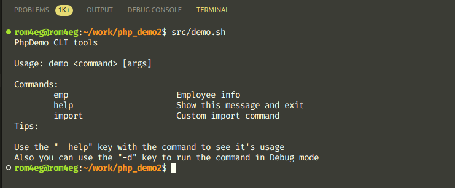
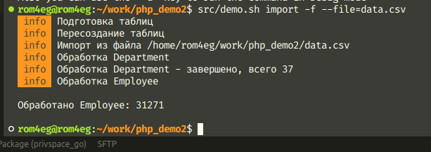
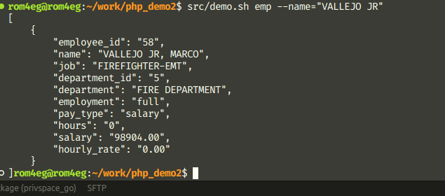
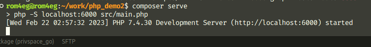
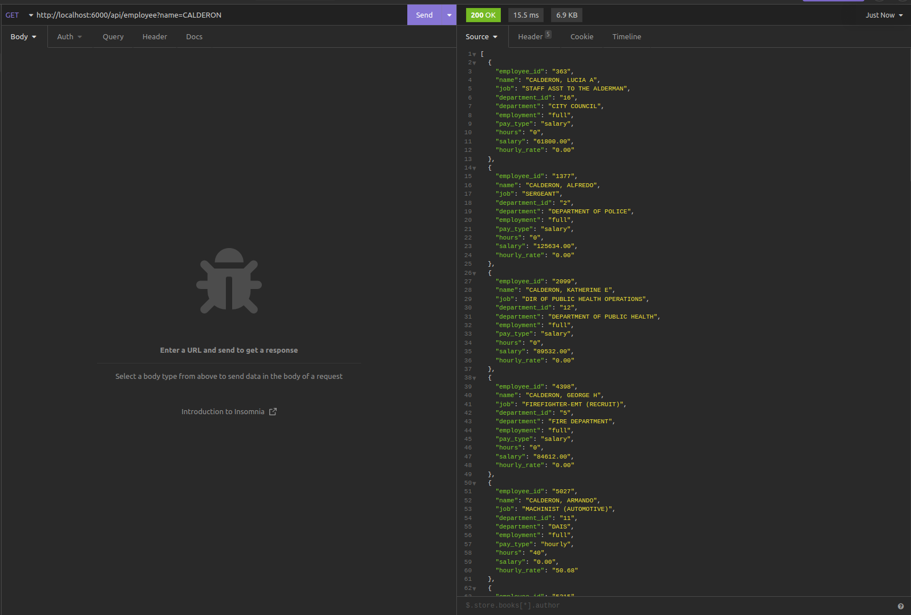
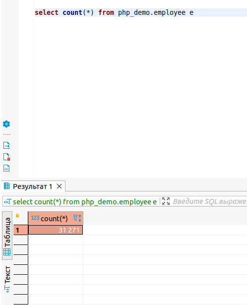
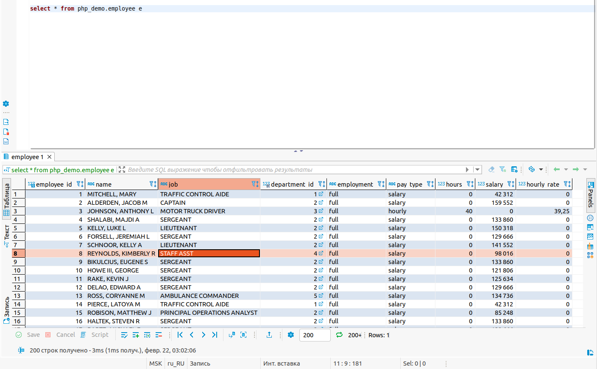
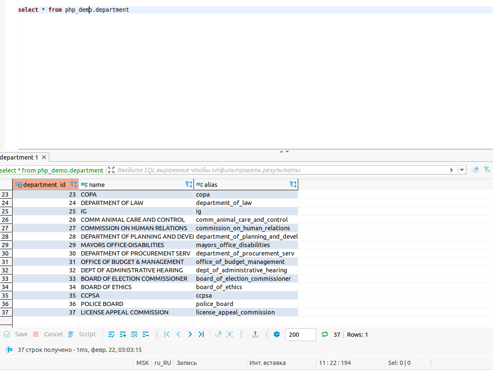

## Тестовое задание

Исходные данные:
    Датасет. Содержит информацию о сотрудниках большого предприятия.

Задача:
* Составить и реализовать объектную модель для птимального хранения этих данных в реляционной бд.
* Добавить консольную команду для загрузки датасета в базу данных.
* Реализовать API для поиска сотрудника по имени. Метод должен возвращать полную информацию о сотруднике, включая всю информацию которая содержится в датасете.

Доп. инфо: Инструменты и средства разработки соискатель выбирает самостоятельно.

### Куда смотреть
1. Почти весь src/Utils это собственные наработки.
1. Импорт в src/Modules/Employee/Import.php
1. Модели в src/Models

### Пояснения
1. Креды для базы захардкодены в src/Utils/DbAccess.php
1. В тестовом задании не используются фреймворки, инструменты или другие внешние зависимости, только собственные наработки.
1. по тз не понятно, какое именно апи нужно, поэтому было сделано http api и возможность использования shell скриптами.
1. Сделано разделение логики т.е. логика обработки импорта в модуле, логика сохранения в модели.

### Демонстрация
1. на скрине 1 показано приветствие CLI интерфейса. 
1. На скрине 2 процесс импорта файла в БД  З.Ы. там используется bulk insert за счет этого импорт 30к записей отрабатывает примерно 2-3 секунды
1. Скрин 3 поиск по бд использую cli интерфейс 
1. Скрины 4 и 5 запуск сервера и использование api через http
 
З.Ы. Тут __важное__ уточнение - http тулзы, вроде роутера/валидатора/санитайзера не делались т.к. сторонние инструменты не используются т.е. для экономии времени, а в свободном доступе их полно.
1. На скринах 6,7,8 показано как все это выглядит в бд.

Скрин 6

Скрин 7

Скрин 8

